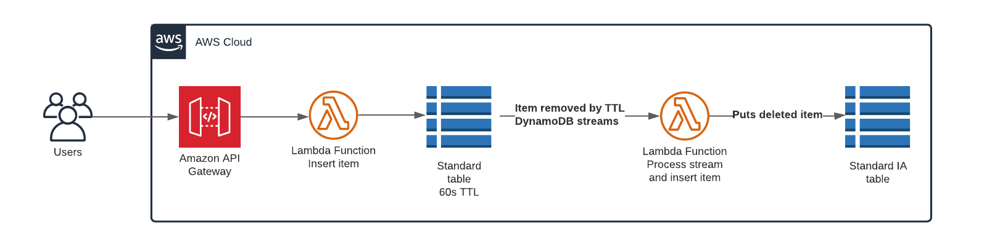

# Amazon Dynamodb Standard-IA

On the December 1, 2021, Amazon DynamoDB announced the new Amazon DynamoDB Standard-Infrequent Access (DynamoDB Standard-IA) table class, which helps you reduce your DynamoDB costs by up to 60 percent for tables that store infrequently accessed data.

That example provides functionality that will help to move your data from Amazon DynamoDB Standard to DynamoDB Standard-Infrequent Access table class using DynamoDB Time to Live (TTL) and DynamoDB Streams.

## Deploy
 * `cdk deploy`      deploy this stack to your default AWS account/region
